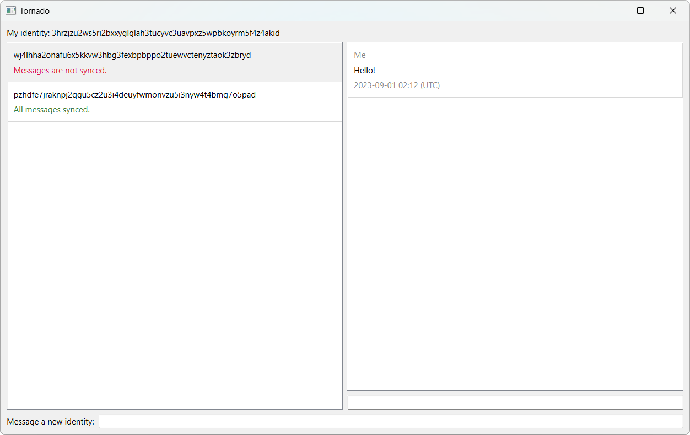

# Tornado
A peer-to-peer, end-to-end encrypted messaging app powered by Tor's hidden services.

**This is experimental software, so don't expect absolute privacy or security!**



To run it, you'll need these Python dependencies:
```
pip install PyQt6 stem flask gevent requests[socks]
```
You'll also need to have the [Tor Browser](https://www.torproject.org/download/) installed.

## Features
<ul>
	<li>Completely peer-to-peer, with no central server involved.</li>
	<li>End-to-end encrypted and contained within the Tor network.</li>
	<li>Your IP address is never revealed to the people you message.</li>
	<li>Difficult to block, since Tor has built-in network circumvention.</li>
</ul>

## Caveats
<ul>
	<li>Both the sender and the receiver must be online to exchange messages in real time.</li>
</ul>

## FAQ
### What does it mean if my messages aren't synced?
It typically means that the recipient has gone offline or closed Tornado, and their endpoint is not accessible to you. This is a fundamental issue with peer-to-peer protocols and cannot be avoided. Don't worry though, as Tornado will resend your messages as soon as the recipient comes online again.

### Tor is running but Tornado doesn't think so?
Your Tor settings are likely misconfigured. If you aren't using the Tor Browser, you will need to tell your Tor client to use port 9150 for the SOCKS proxy and port 9151 for the Control Port. Alternatively, you can change port 9150 to 9050 and port 9151 to 9051 in the code, which will work for typical Tor services.

### How do I change my identity?
To change or delete your identity, simple delete the `.tornado` folder in your home directory. This will permanently delete your identity, contacts, and messages, and your existing contacts will no longer be able to message you. The next time you launch Tornado, a new identity will created for you and you can start fresh again.

### How do I transfer my identity and messages to a new device?
Just copy the `.tornado` folder in your home directory to your home directory on your new computer. Tornado will automatically use your old identity and data when you run it. Make sure to only run your identity on one device, though. If you're running two instances of the same identity, it would be like having two phones with the same number... which one should get the calls? Regardless of the answer, just don't do it.

## How It Works
At the core of Tornado is Tor's hidden service feature, which allows anyone to host a "publicly" accessible server without opening ports or firewalls. When you launch Tornado, it starts a local HTTP server and a hidden service that points to it. The address of the hidden service is your identity. When you message someone by their identity, Tornado sends an HTTP request with the message to their hidden service, which in turn forwards it to their local HTTP server. From there, the message is received by Tornado and shown in the application appropriately. While this provides privacy and security, it has one inherent issue, which is that if the recipient goes offline or closes Tornado, the hidden services goes down as well. To ensure that messages are delivered once the recipient comes online again, Tornado will periodically try to resend any unsent messages. Although not perfect, this system is about as good as it can get without requiring centralized components and thereby defeating the whole purpose of the software.

## To-Do
Here are some things that I may or may not have time to implement, but don't want to forget:
<ul>
	<li>Cryptographically verify that a sender's identity is authentic</li>
	<li>Ability to delete a chat with someone</li>
	<li>Ability to block an identity from messaging you</li>
	<li>Rename a long identity to a shorter name or username</li>
	<li>Ability to send images, videos, and files</li>
	<li>Detect when Tor goes offline and reconnect accordingly</li>
	<li>Move contacts with new messages to the top</li>
	<li>Fix long messages in QLabel being cut off</li>
</ul>
